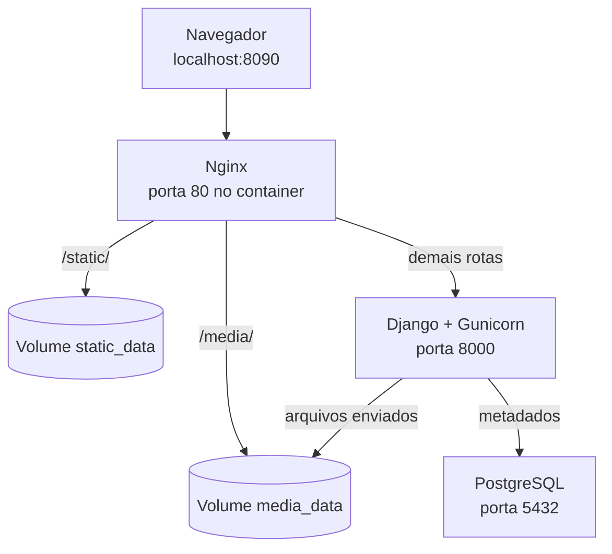

# Central de Arquivos — Django, Nginx, PostgreSQL e Docker

Projeto demonstrativo local de uma aplicação Django com upload de arquivos persistente. A aplicação é executada em containers separados para Django/Gunicorn, Nginx e PostgreSQL.

## O que o projeto demonstra

- criação de uma imagem Docker própria para Django;
- execução do Django com Gunicorn;
- uso do Nginx como proxy reverso;
- banco PostgreSQL em container;
- upload de arquivos pelo Django;
- persistência dos uploads usando Docker Volume;
- separação entre código da aplicação, proxy e banco de dados.

## Arquitetura



## Papel de cada serviço

### `web` — Django + Gunicorn

É o serviço principal da aplicação. O container é construído a partir do `Dockerfile`, instala as dependências Python e executa o Django com Gunicorn.

Ao iniciar, o `entrypoint.sh` aguarda o PostgreSQL, executa migrations, coleta os arquivos estáticos e inicia o Gunicorn na porta interna `8000`.

### `nginx` — proxy reverso

É o único serviço publicado para acesso HTTP:

- `/static/`: serve arquivos estáticos do volume `static_data`;
- `/media/`: serve os arquivos enviados do volume `media_data`;
- demais caminhos: encaminha para `web:8000`.

### `db` — PostgreSQL

Armazena os dados da aplicação no volume `postgres_data`. A porta é publicada somente em `127.0.0.1:15432`, permitindo acesso local pelo DBeaver.

## Estrutura de diretórios

```text
.
├── app/
│   ├── manage.py                         # Comandos administrativos do Django
│   ├── config/                           # Configuração do projeto Django
│   │   ├── settings.py                   # Banco, apps, estáticos e mídia
│   │   ├── urls.py                       # Rotas principais
│   │   └── wsgi.py                       # Entrada usada pelo Gunicorn
│   └── envios/                           # Aplicação responsável pelos uploads
│       ├── models.py                      # Modelo ArquivoEnviado
│       ├── forms.py                       # Validação do upload
│       ├── views.py                       # Lista e recebe arquivos
│       ├── urls.py                        # Rotas da aplicação
│       ├── admin.py                       # Registro no admin
│       ├── migrations/                    # Histórico do banco
│       ├── templates/envios/              # Páginas HTML
│       └── static/envios/                 # CSS
├── nginx/default.conf                     # Proxy e arquivos estáticos/mídia
├── docs/arquitetura.md                    # Resumo visual
├── Dockerfile                             # Imagem própria do Django
├── docker-compose.yml                     # Serviços, rede e volumes
├── entrypoint.sh                          # Inicialização do Django
├── requirements.txt                       # Dependências Python
├── .env.example                           # Exemplo de variáveis
└── .gitignore                             # Arquivos ignorados pelo Git
```

## Como funciona o upload

1. O usuário acessa `/enviar/` pelo Nginx.
2. O formulário envia o arquivo ao Django.
3. O formulário valida extensão e tamanho máximo de 10 MB.
4. O Django salva os metadados no PostgreSQL.
5. O arquivo físico é salvo em `/app/media`, ligado ao volume `media_data`.
6. O Nginx monta o mesmo volume em `/var/www/media` e serve o arquivo por `/media/`.

## Como executar

### Pré-requisitos

- Docker Desktop com Docker Compose;
- portas `8090` e `15432` disponíveis.

### Inicialização

Na raiz do projeto:

```powershell
Copy-Item .env.example .env
docker compose up --build -d
```

Acesse:

- aplicação: http://localhost:8090
- administração Django: http://localhost:8090/admin/
- PostgreSQL: `localhost:15432`

Credenciais do DBeaver (use os valores definidos no seu arquivo `.env`):

```text
Host: localhost
Porta: 15432
Banco: aplicacao
Usuário: aplicacao
Senha: o valor de `POSTGRES_PASSWORD` no seu `.env`
```

## Comandos úteis

```powershell
docker compose ps
docker compose logs -f web
docker compose logs -f nginx
docker compose logs -f db
docker compose down
docker compose up --build -d
docker compose exec web sh
docker compose exec web python manage.py check
docker compose exec web python manage.py createsuperuser
```

`docker compose down` preserva os volumes. Não use `docker compose down -v` se quiser manter banco, uploads e estáticos.

## Variáveis de ambiente

Copie `.env.example` para `.env`. As principais variáveis são:

- `DEBUG`: modo de depuração;
- `SECRET_KEY`: chave secreta do Django;
- `POSTGRES_DB`, `POSTGRES_USER`, `POSTGRES_PASSWORD`: credenciais do banco;
- `PORTA_NGINX`: porta HTTP local;
- `HOSTS_PERMITIDOS`: hosts aceitos;
- `ORIGENS_CSRF_PERMITIDAS`: origens confiáveis para CSRF.

O arquivo `.env` está no `.gitignore` e não deve ser versionado.

## Volumes

| Volume | Conteúdo | Uso |
|---|---|---|
| `postgres_data` | Dados do PostgreSQL | Preserva o banco |
| `media_data` | Arquivos enviados | Preserva uploads |
| `static_data` | Arquivos coletados | Permite ao Nginx servir CSS |

## Limitações conhecidas

Este é um projeto local de demonstração. O upload é anônimo, os arquivos ficam acessíveis pelo Nginx e a validação verifica extensão e tamanho, não o conteúdo real.
