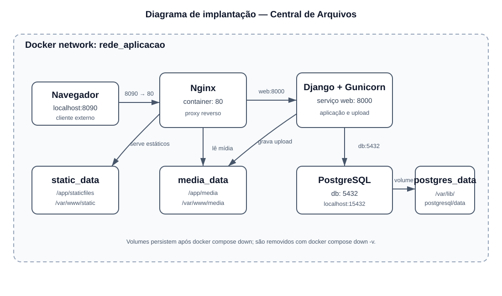
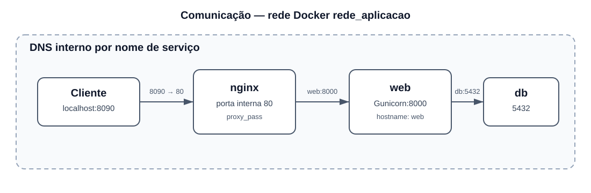
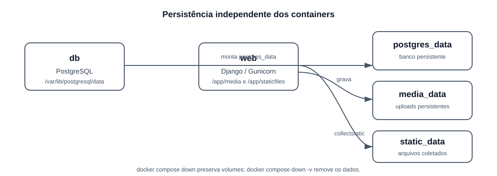
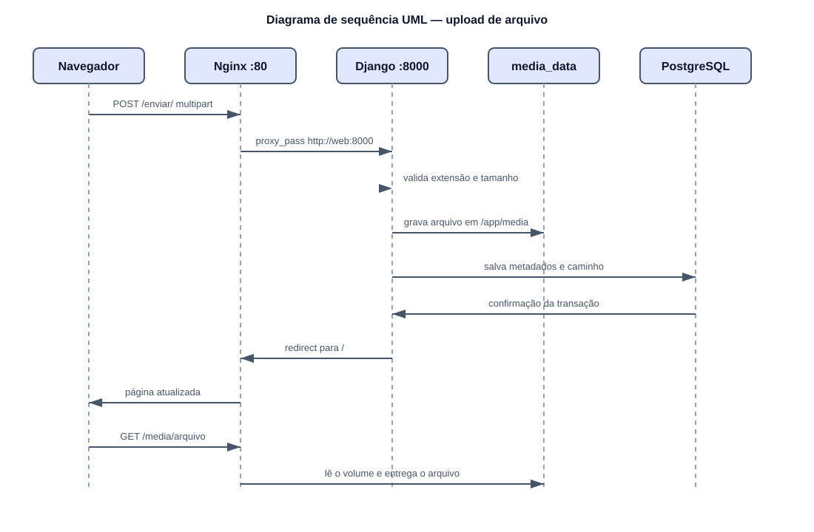

# Central de Arquivos — Django, Nginx, PostgreSQL e Docker

Projeto demonstrativo local de uma aplicação Django com upload de arquivos persistente. A aplicação é executada em containers separados para Django/Gunicorn, Nginx e PostgreSQL.

## O que o projeto demonstra

- criação de uma imagem Docker própria para Django;
- execução do Django com Gunicorn;
- uso do Nginx como proxy reverso;
- banco PostgreSQL em container;
- upload de arquivos pelo Django;
- persistência dos uploads usando Docker Volume;
- separação entre código da aplicação, proxy e banco de dados.

## Arquitetura

Os diagramas da arquitetura estão centralizados em [docs/arquitetura.md](docs/arquitetura.md), incluindo implantação, componentes, comunicação, dependências e fluxo de upload.

Para consultar os diagramas completos e suas explicações, acesse [docs/arquitetura.md](docs/arquitetura.md).

## Papel de cada serviço

### `web` — Django + Gunicorn

É o serviço principal da aplicação. O container é construído a partir do `Dockerfile`, instala as dependências Python e executa o Django com Gunicorn.

Ao iniciar, o `entrypoint.sh` aguarda o PostgreSQL, executa migrations, coleta os arquivos estáticos e inicia o Gunicorn na porta interna `8000`.

### `nginx` — proxy reverso

É o único serviço publicado para acesso HTTP:

- `/static/`: serve arquivos estáticos do volume `static_data`;
- `/media/`: serve os arquivos enviados do volume `media_data`;
- demais caminhos: encaminha para `web:8000`.

### `db` — PostgreSQL

Armazena os dados da aplicação no volume `postgres_data`. A porta é publicada somente em `127.0.0.1:15432`, permitindo acesso local pelo DBeaver.

## Estrutura de diretórios

```text
.
├── app/
│   ├── manage.py                         # Comandos administrativos do Django
│   ├── config/                           # Configuração do projeto Django
│   │   ├── settings.py                   # Banco, apps, estáticos e mídia
│   │   ├── urls.py                       # Rotas principais
│   │   └── wsgi.py                       # Entrada usada pelo Gunicorn
│   └── envios/                           # Aplicação responsável pelos uploads
│       ├── models.py                      # Modelo ArquivoEnviado
│       ├── forms.py                       # Validação do upload
│       ├── views.py                       # Lista e recebe arquivos
│       ├── urls.py                        # Rotas da aplicação
│       ├── admin.py                       # Registro no admin
│       ├── migrations/                    # Histórico do banco
│       ├── templates/envios/              # Páginas HTML
│       └── static/envios/                 # CSS
├── nginx/default.conf                     # Proxy e arquivos estáticos/mídia
├── docs/arquitetura.md                    # Resumo visual
├── Dockerfile                             # Imagem própria do Django
├── docker-compose.yml                     # Serviços, rede e volumes
├── entrypoint.sh                          # Inicialização do Django
├── requirements.txt                       # Dependências Python
├── .env.example                           # Exemplo de variáveis
└── .gitignore                             # Arquivos ignorados pelo Git
```

## Como funciona o upload

1. O usuário acessa `/enviar/` pelo Nginx.
2. O formulário envia o arquivo ao Django.
3. O formulário valida extensão e tamanho máximo de 10 MB.
4. O Django salva os metadados no PostgreSQL.
5. O arquivo físico é salvo em `/app/media`, ligado ao volume `media_data`.
6. O Nginx monta o mesmo volume em `/var/www/media` e serve o arquivo por `/media/`.

## Como executar

### Pré-requisitos

- Docker Engine instalado no WSL;
- Docker Compose Plugin disponível (`docker compose version`);
- portas `8090` e `15432` disponíveis.

### Inicialização

Na raiz do projeto:

```powershell
Copy-Item .env.example .env
docker compose up --build -d
```

Acesse:

- aplicação: http://localhost:8090
- administração Django: http://localhost:8090/admin/
- PostgreSQL: `localhost:15432`

Credenciais do DBeaver (use os valores definidos no seu arquivo `.env`):

```text
Host: localhost
Porta: 15432
Banco: aplicacao
Usuário: aplicacao
Senha: o valor de `POSTGRES_PASSWORD` no seu `.env`
```

## Comandos úteis

```powershell
docker compose ps
docker compose logs -f web
docker compose logs -f nginx
docker compose logs -f db
docker compose down
docker compose up --build -d
docker compose exec web sh
docker compose exec web python manage.py check
docker compose exec web python manage.py createsuperuser
```

### Solução de problemas

Se a aplicação não abrir, verifique se o arquivo `.env` existe, se as portas `8090` e `15432` estão livres e consulte o estado dos serviços:

```powershell
docker compose ps
docker compose logs web
docker compose logs nginx
docker compose logs db
```

Se `docker compose` não for reconhecido, instale ou habilite o Docker Compose Plugin no ambiente WSL.

`docker compose down` preserva os volumes. Não use `docker compose down -v` se quiser manter banco, uploads e estáticos.

## Variáveis de ambiente

Copie `.env.example` para `.env`. As principais variáveis são:

- `DEBUG`: modo de depuração;
- `SECRET_KEY`: chave secreta do Django;
- `POSTGRES_DB`, `POSTGRES_USER`, `POSTGRES_PASSWORD`: credenciais do banco;
- `PORTA_NGINX`: porta HTTP local;
- `HOSTS_PERMITIDOS`: hosts aceitos;
- `ORIGENS_CSRF_PERMITIDAS`: origens confiáveis para CSRF.

## Volumes

| Volume | Conteúdo | Uso |
|---|---|---|
| `postgres_data` | Dados do PostgreSQL | Preserva o banco |
| `media_data` | Arquivos enviados | Preserva uploads |
| `static_data` | Arquivos coletados | Permite ao Nginx servir CSS |

## Ambiente Python e `venv`

O `venv` local é opcional. Como a execução oficial utiliza Docker Compose, o Python e as dependências são instalados no container `web`. O ambiente virtual só é necessário para executar o Django diretamente fora do Docker e não deve ser versionado.

## Defesa técnica — explicação completa

### 1. Visão geral da arquitetura

#### Arquitetura da solução

A solução é dividida em três containers conectados pela rede Docker `rede_aplicacao`:

- `web`: Django executado pelo Gunicorn;
- `nginx`: proxy reverso e servidor de arquivos;
- `db`: PostgreSQL.

O fluxo principal é:

1. o navegador acessa `http://localhost:8090`;
2. o Nginx recebe a requisição;
3. arquivos estáticos e uploads são servidos diretamente pelo Nginx;
4. outras rotas são encaminhadas para `web:8000`;
5. o Django processa a requisição;
6. quando necessário, o Django acessa `db:5432`;
7. o PostgreSQL guarda os metadados;
8. o volume de mídia guarda o arquivo físico.

O navegador não acessa diretamente o Gunicorn. O DBeaver acessa o banco pelo mapeamento local `localhost:15432 -> db:5432`.

#### Diagrama de Implantação (Deployment Diagram)

O Diagrama de Implantação está em [docs/arquitetura.md](docs/arquitetura.md). Ele mostra cliente, containers, portas publicadas e internas, rede `rede_aplicacao`, volumes e comunicação.



Este é o Diagrama de Implantação da solução. Ele representa:

- **Cliente:** navegador e DBeaver fora da rede Docker;
- **Containers:** `nginx`, `web` e `db`;
- **Rede Docker:** `rede_aplicacao`, representada pelo agrupamento dos containers;
- **Portas publicadas:** `localhost:8090` para o Nginx e `localhost:15432` para o PostgreSQL;
- **Portas internas:** `nginx:80`, `web:8000` e `db:5432`;
- **Volumes persistentes:** `postgres_data`, `media_data` e `static_data`;
- **Comunicação:** Cliente → `nginx` → `web` → `db`;
- **Armazenamento:** `web` grava uploads em `media_data` e `db` grava dados em `postgres_data`.

O diagrama também deixa explícito que o Nginx lê `media_data` e `static_data`, enquanto o PostgreSQL utiliza `postgres_data`.

#### Diagrama de Componentes

O diagrama abaixo não representa máquinas, containers ou volumes. Ele representa os componentes lógicos e suas responsabilidades na comunicação da aplicação.

O Diagrama de Componentes está em [docs/arquitetura.md](docs/arquitetura.md). Ele apresenta a colaboração lógica entre Cliente, Nginx, Django/Gunicorn, PostgreSQL e volumes.

Este segundo diagrama mostra **como** os componentes colaboram. O diagrama anterior mostra **onde** eles são implantados. Portanto, ambos são utilizados com nomes diferentes e não representam a mesma visão arquitetural.

#### Portas utilizadas

| Origem | Destino | Porta publicada | Porta interna | Finalidade |
|---|---|---:|---:|---|
| Navegador | `nginx` | `localhost:8090` | `80` | acesso HTTP à aplicação |
| Nginx | `web` | não publicada | `8000` | rotas Django via Gunicorn |
| Django | `db` | não publicada | `5432` | conexão PostgreSQL interna |
| DBeaver | `db` | `localhost:15432` | `5432` | acesso local ao PostgreSQL |

`8090`, `15432` e `localhost` são usados pelo computador do usuário. `web`, `db`, `8000` e `5432` são usados dentro da rede Docker.

#### Rede Docker e comunicação entre containers

Os serviços participam da rede `rede_aplicacao`, declarada no `docker-compose.yml`. Nessa rede, o Docker fornece resolução de nomes: `web` aponta para o container Django e `db` aponta para o container PostgreSQL.

Assim, o Nginx usa `http://web:8000` e o Django usa `POSTGRES_HOST=db`. Eles não usam `localhost` para encontrar outros containers, porque `localhost` significaria o próprio container atual.

#### Volumes e armazenamento

| Volume | Container que grava | Caminho de gravação | Container que lê | Conteúdo |
|---|---|---|---|---|
| `postgres_data` | `db` | `/var/lib/postgresql/data` | `db` | dados físicos do PostgreSQL |
| `media_data` | `web` | `/app/media` | `nginx` | arquivos enviados pela aplicação |
| `static_data` | `web` | `/app/staticfiles` | `nginx` | CSS e arquivos estáticos |

Quando o usuário envia um arquivo, o Django grava o conteúdo em `/app/media`, que pertence ao volume `media_data`. O PostgreSQL guarda os metadados, como nome original, tamanho, data e caminho. O Nginx monta o mesmo volume em `/var/www/media` e entrega o arquivo pela URL `/media/`.

Os diagramas oficiais e suas explicações estão centralizados em [docs/arquitetura.md](docs/arquitetura.md).

#### Artefatos de modelagem utilizados

Para representar tecnicamente a solução, foram utilizados dois artefatos compatíveis com UML e C4:

- **Diagrama de Implantação:** representa o cliente, os containers, a rede Docker, as portas publicadas e os volumes persistentes.
- **Diagrama de Componentes:** representa a comunicação lógica entre Cliente, Nginx, Django/Gunicorn, PostgreSQL e volumes. Ele está em [docs/arquitetura.md](docs/arquitetura.md).

O uso combinado é importante porque cada diagrama responde a uma pergunta diferente: o Diagrama de Implantação mostra **onde** cada parte executa e como ela é conectada; o Diagrama de Componentes mostra **como** as partes colaboram para atender uma requisição e armazenar um upload.

| Elemento | Tipo | Endereço | Função |
|---|---|---|---|
| Cliente | externo | `localhost:8090` | envia requisições e arquivos |
| Nginx | container | `nginx:80` | proxy, estáticos e mídia |
| Django/Gunicorn | container | `web:8000` | regras da aplicação e upload |
| PostgreSQL | container | `db:5432` | metadados e dados do Django |
| `media_data` | volume | `/app/media` e `/var/www/media` | arquivos enviados |
| `static_data` | volume | `/app/staticfiles` e `/var/www/static` | CSS e estáticos |
| `postgres_data` | volume | `/var/lib/postgresql/data` | dados físicos do banco |

### 2. Imagem Docker da aplicação Django

O [Dockerfile](Dockerfile) desenvolve uma imagem própria para executar a aplicação Django. A imagem contém o runtime Python, as dependências, o código da aplicação e o script responsável pela inicialização.

#### Imagem base utilizada

```dockerfile
FROM python:3.12-slim
```

Foi escolhida `python:3.12-slim` porque o projeto precisa do interpretador Python para executar Django e Gunicorn, mas não precisa de uma distribuição completa. A variante `slim` reduz o tamanho da imagem e a quantidade de pacotes desnecessários.

Essa imagem também evita instalar Python manualmente e oferece uma base oficial e reproduzível para a aplicação. O projeto utiliza containers Linux porque Django, Gunicorn e PostgreSQL são executados dentro da rede Docker.

#### Variáveis de ambiente do Python

```dockerfile
ENV PYTHONDONTWRITEBYTECODE=1 PYTHONUNBUFFERED=1
```

- `PYTHONDONTWRITEBYTECODE=1` evita arquivos `.pyc` desnecessários dentro da imagem;
- `PYTHONUNBUFFERED=1` faz os logs aparecerem imediatamente no terminal, o que facilita acompanhar `docker compose logs`.

Essas variáveis não configuram o banco nem o Django. As configurações da aplicação são recebidas pelo `docker-compose.yml` em tempo de execução.

#### Organização dos arquivos e `WORKDIR`

```dockerfile
WORKDIR /app
```

O diretório `/app` é o local padrão de execução dentro do container. O código do diretório local `app/` é copiado para esse diretório:

```dockerfile
COPY app/ .
```

Consequentemente, dentro da imagem:

```text
/app/manage.py
/app/config/
/app/envios/
/app/media/
/app/staticfiles/
```

O `Dockerfile` também copia o script de inicialização para a raiz do container:

```dockerfile
COPY entrypoint.sh /entrypoint.sh
```

Essa organização permite que `python manage.py` seja executado diretamente a partir de `/app`.

#### Instalação das dependências

```dockerfile
COPY requirements.txt .
RUN pip install --no-cache-dir -r requirements.txt
```

O arquivo de dependências é copiado antes do código-fonte. Isso permite que o Docker reaproveite a camada de instalação quando apenas o código da aplicação mudar.

As principais dependências são:

- Django: framework web;
- Gunicorn: servidor WSGI da aplicação;
- Psycopg: driver Python para PostgreSQL.

O parâmetro `--no-cache-dir` evita manter o cache de pacotes dentro da imagem, reduzindo seu tamanho final.

#### Comandos executados durante o build

```dockerfile
RUN pip install --no-cache-dir -r requirements.txt
RUN chmod +x /entrypoint.sh
```

O primeiro comando instala as dependências. O segundo torna o `entrypoint.sh` executável dentro da imagem.

Migrations e `collectstatic` não são executados durante o build. Eles dependem do ambiente em execução, especialmente do PostgreSQL e dos volumes. Por isso são executados pelo `entrypoint.sh` quando o container inicia.

#### Inicialização da aplicação

```dockerfile
ENTRYPOINT ["/entrypoint.sh"]
```

O `ENTRYPOINT` garante que todo container `web` execute o mesmo processo de preparação:

1. aguarda o PostgreSQL;
2. executa `python manage.py migrate --noinput`;
3. executa `python manage.py collectstatic --noinput`;
4. inicia o. Gunicorn.

O script usa `exec` no comando final para que o Gunicorn se torne o processo principal do container e receba corretamente sinais de parada do Docker.

#### Uso do Gunicorn

```bash
gunicorn config.wsgi:application --bind 0.0.0.0:8000
```

O Gunicorn é usado porque o servidor de desenvolvimento do Django não é apropriado para o fluxo com Nginx. Ele executa o objeto WSGI criado em `app/config/wsgi.py`, representado por `config.wsgi:application`.

O bind `0.0.0.0:8000` faz o Gunicorn escutar em todas as interfaces do container. Isso é necessário para que o Nginx, que está em outro container, consiga acessá-lo por `web:8000`.

O Nginx não inicia o Django diretamente: ele apenas encaminha requisições para o Gunicorn. A separação permite que cada componente tenha uma responsabilidade clara.

#### Imagem de estágio único

O Dockerfile utiliza um único estágio. Isso é suficiente porque não há frontend que precise ser compilado nem artefatos de build que precisem ser copiados para uma segunda imagem. Para este projeto local, a simplicidade facilita explicar o processo de construção e execução.

### 3. Orquestração com Docker Compose

O arquivo `docker-compose.yml` é o orquestrador da solução. Ele define quais containers serão criados, como serão configurados, como se comunicam e quais dados devem sobreviver à recriação dos containers.

#### Serviço `db` — PostgreSQL

| Item | Configuração atual |
|---|---|
| Serviço | `db` |
| Imagem | `postgres:16-alpine` |
| Porta interna | `5432` |
| Porta publicada | `127.0.0.1:15432:5432` |
| Rede | `rede_aplicacao` |
| Volume | `postgres_data:/var/lib/postgresql/data` |
| Variáveis | `POSTGRES_DB`, `POSTGRES_USER`, `POSTGRES_PASSWORD` |
| Dependências | nenhuma |
| Inicialização | imagem oficial executa o PostgreSQL |

O PostgreSQL usa a variante Alpine para reduzir o tamanho da imagem. A porta é publicada somente em `127.0.0.1`, permitindo acesso local pelo DBeaver sem expor o banco diretamente à rede externa. O volume `postgres_data` preserva os dados.

O healthcheck executa `pg_isready` para verificar se o banco está pronto. Essa informação é usada pelo serviço `web` na condição `service_healthy`.

#### Serviço `web` — Django/Gunicorn

| Item | Configuração atual |
|---|---|
| Serviço | `web` |
| Imagem | construída localmente com `build: .` |
| Base da imagem | `Dockerfile` |
| Porta interna | `8000` |
| Porta publicada | não publicada no host |
| Rede | `rede_aplicacao` |
| Volumes | `static_data:/app/staticfiles`, `media_data:/app/media` |
| Variáveis | `DEBUG`, `SECRET_KEY`, hosts, CSRF e PostgreSQL |
| Dependências | `db` saudável |
| Inicialização | `entrypoint.sh` |

O serviço `web` não precisa publicar a porta `8000`, porque somente o Nginx acessa o Django. Isso reduz a superfície de acesso e mantém a comunicação `web:8000` dentro da rede Docker.

As variáveis de banco são recebidas pelo Compose e usadas em `settings.py`. O `entrypoint.sh` aguarda o banco, executa migrations, coleta estáticos e inicia o Gunicorn.

#### Serviço `nginx` — proxy reverso

| Item | Configuração atual |
|---|---|
| Serviço | `nginx` |
| Imagem | `nginx:1.27-alpine` |
| Porta interna | `80` |
| Porta publicada | `${PORTA_NGINX:-8090}:80` |
| Rede | `rede_aplicacao` |
| Dependências | `web` iniciado |
| Configuração | `./nginx/default.conf:/etc/nginx/conf.d/default.conf:ro` |
| Volumes | `static_data:/var/www/static:ro`, `media_data:/var/www/media:ro` |

O Nginx é o único serviço HTTP publicado. O modo `ro` nos volumes impede que ele altere os arquivos enviados ou os estáticos. A dependência de `web` garante que o proxy seja iniciado depois do serviço da aplicação.

#### Variáveis de ambiente e segurança

O Compose recebe valores do `.env`. A senha é obrigatória e não possui fallback público:

```yaml
POSTGRES_PASSWORD: ${POSTGRES_PASSWORD:?Defina POSTGRES_PASSWORD no arquivo .env}
```

O `.env` é ignorado pelo Git. O `.env.example` contém somente um placeholder para orientar a configuração local.

#### Rede e dependências

Todos os serviços participam da rede `rede_aplicacao`. A dependência de inicialização é:

O diagrama de dependências e inicialização está centralizado em [docs/arquitetura.md](docs/arquitetura.md).

O `depends_on` controla a ordem de criação/inicialização, mas não garante sozinho que o serviço esteja pronto para aceitar conexões. Por isso, o healthcheck confirma a disponibilidade real do PostgreSQL e o `entrypoint.sh` ainda aguarda uma conexão antes de iniciar a aplicação.

### 4. Comunicação entre containers

Os containers se comunicam por meio da rede Docker `rede_aplicacao`, declarada no `docker-compose.yml`. Quando serviços participam da mesma rede, o Docker fornece um DNS interno que resolve automaticamente os nomes dos serviços.

Neste projeto, os nomes usados como hostnames são:

- `nginx`: container do proxy reverso;
- `web`: container Django/Gunicorn;
- `db`: container PostgreSQL.

Por isso, os containers não usam endereços IP fixos. Eles usam os nomes dos serviços, que continuam válidos mesmo quando o Docker recria os containers.

#### Comunicação Nginx → Django/Gunicorn

O navegador acessa o endereço publicado pelo Nginx:

```text
localhost:8090
```

O Docker encaminha essa porta para a porta `80` do container `nginx`. O Nginx analisa o caminho solicitado:

- `/static/`: serve diretamente do volume de arquivos estáticos;
- `/media/`: serve diretamente do volume de uploads;
- outras rotas: encaminha para o Django.

Para as rotas dinâmicas, o arquivo `nginx/default.conf` usa:

```nginx
proxy_pass http://web:8000;
```

O hostname `web` é resolvido pelo DNS interno da rede `rede_aplicacao`. A porta `8000` é a porta interna na qual o Gunicorn escuta dentro do container Django.

O Django não precisa publicar a porta `8000` no Windows. O Nginx consegue acessá-la diretamente porque está na mesma rede Docker.

#### Comunicação Django → PostgreSQL

O Django recebe as configurações do banco pelas variáveis de ambiente do Compose:

```text
POSTGRES_HOST=db
POSTGRES_PORT=5432
```

No `settings.py`, essas variáveis são utilizadas na configuração `DATABASES`. Quando o Django precisa consultar ou gravar dados, o driver Psycopg abre uma conexão para:

```text
db:5432
```

O nome `db` é resolvido para o endereço interno atual do container PostgreSQL. A porta `5432` é a porta interna do PostgreSQL dentro da rede Docker.

#### Portas internas e portas externas

Portas internas são usadas entre containers. Portas externas são publicadas no computador do usuário.

```text
Navegador -> localhost:8090 -> nginx:80
Nginx -> web:8000
Django -> db:5432
DBeaver -> localhost:15432 -> db:5432
```

O mapeamento `127.0.0.1:15432:5432` permite que o DBeaver acesse o PostgreSQL sem tornar a porta do banco pública para outras máquinas. Já `web:8000` e `db:5432` não precisam de publicação externa, pois são comunicações internas.

#### Diagrama da comunicação

O diagrama de sequência da comunicação está em [docs/arquitetura.md](docs/arquitetura.md).



### 5. Nginx e proxy reverso

O Nginx é o ponto de entrada HTTP da arquitetura e funciona como proxy reverso. O navegador não acessa diretamente o Gunicorn. Ele envia a requisição para `localhost:8090`, que é encaminhada pelo Docker para a porta `80` do container `nginx`.

Depois de receber a requisição, o Nginx identifica o caminho da URL e escolhe uma destas ações:

1. servir um arquivo estático diretamente;
2. servir um arquivo enviado diretamente;
3. encaminhar a requisição para Django/Gunicorn.

#### Portas envolvidas

```text
Cliente -> localhost:8090 -> nginx:80
Nginx -> web:8000 -> Gunicorn/Django
```

A porta `8090` é externa e pode ser alterada por `PORTA_NGINX`. A porta `80` é interna ao container Nginx. A porta `8000` é interna ao container `web` e não é publicada no computador.

#### Configuração completa utilizada

O arquivo [nginx/default.conf](nginx/default.conf) contém:

```nginx
server {
    listen 80;
    server_name _;
    client_max_body_size 10m;

    location /static/ {
        alias /var/www/static/;
        expires 7d;
    }

    location /media/ {
        alias /var/www/media/;
    }

    location / {
        proxy_pass http://web:8000;
        proxy_set_header Host $host;
        proxy_set_header X-Real-IP $remote_addr;
        proxy_set_header X-Forwarded-For $proxy_add_x_forwarded_for;
        proxy_set_header X-Forwarded-Proto $scheme;
    }
}
```

#### `listen 80`

```nginx
listen 80;
```

Define a porta em que o Nginx escuta dentro do container. O Docker publica essa porta no computador por meio de `${PORTA_NGINX:-8090}:80`.

#### `server_name _`

```nginx
server_name _;
```

Aceita requisições independentemente do hostname informado. Isso é conveniente para o ambiente local acessado por `localhost` ou `127.0.0.1`.

#### `client_max_body_size 10m`

```nginx
client_max_body_size 10m;
```

Limita o corpo da requisição HTTP a 10 MB no proxy. Esse limite complementa a validação do Django em `forms.py`, evitando que arquivos maiores sejam encaminhados para a aplicação.

#### `location /static/`

```nginx
location /static/ {
    alias /var/www/static/;
    expires 7d;
}
```

O Nginx atende arquivos estáticos diretamente do volume `static_data`, montado no container em `/var/www/static`. `expires 7d` permite que o navegador mantenha esses arquivos em cache por sete dias.

#### `location /media/`

```nginx
location /media/ {
    alias /var/www/media/;
}
```

O Nginx serve diretamente os uploads do volume `media_data`, montado em `/var/www/media`. Por isso o Django não precisa ler e transmitir o arquivo a cada download.

#### `location /` e `proxy_pass`

```nginx
location / {
    proxy_pass http://web:8000;
}
```

Esse é o proxy reverso propriamente dito. Todas as rotas que não foram atendidas pelos blocos mais específicos são encaminhadas para o serviço `web`, na porta interna `8000`.

O hostname `web` é resolvido pelo DNS interno da rede Docker `rede_aplicacao`.

#### Headers encaminhados

```nginx
proxy_set_header Host $host;
proxy_set_header X-Real-IP $remote_addr;
proxy_set_header X-Forwarded-For $proxy_add_x_forwarded_for;
proxy_set_header X-Forwarded-Proto $scheme;
```

Esses headers preservam informações importantes da requisição original:

- `Host`: hostname usado pelo cliente;
- `X-Real-IP`: endereço IP original;
- `X-Forwarded-For`: cadeia de proxies atravessados;
- `X-Forwarded-Proto`: protocolo original, como HTTP ou HTTPS.

O Nginx é importante porque centraliza o acesso HTTP, serve arquivos diretamente e mantém o Gunicorn acessível apenas pela rede interna do Docker.

### 6. Persistência de dados

Containers são voláteis: seus sistemas de arquivos internos podem ser perdidos quando o container é removido. Um volume é gerenciado separadamente pelo Docker e preserva os dados mesmo quando o container é recriado. Por isso, os dados que precisam sobreviver ao ciclo de vida dos containers são armazenados em volumes nomeados.

Neste projeto, a persistência é analisada separadamente para o banco e para os arquivos enviados.

#### Persistência do PostgreSQL

O serviço `db` monta:

```yaml
postgres_data:/var/lib/postgresql/data
```

O volume `postgres_data` contém os arquivos físicos do PostgreSQL, incluindo:

- tabelas da aplicação;
- registros de usuários, sessões e permissões do Django;
- histórico de migrations;
- metadados dos uploads;
- índices e demais estruturas internas do banco.

Se o container `db` for removido, mas o volume for mantido, os dados continuam existindo. Quando o Compose criar um novo container PostgreSQL, ele montará novamente o mesmo `postgres_data` e o banco voltará com os dados anteriores.

#### Persistência dos arquivos enviados

O serviço `web` monta:

```yaml
media_data:/app/media
```

O Django grava os arquivos físicos nesse caminho. O volume `media_data` preserva:

- PDFs;
- imagens;
- textos;
- documentos DOCX;
- apresentações PPTX;
- demais arquivos aceitos pelo formulário.

O Nginx monta o mesmo volume como somente leitura:

```yaml
media_data:/var/www/media:ro
```

Assim, o Django grava o upload e o Nginx lê o conteúdo para disponibilizá-lo em `/media/`. O registro no PostgreSQL e o arquivo físico são separados, mas relacionados pelo caminho armazenado no campo `FileField`.

#### Persistência dos arquivos estáticos

O volume `static_data` é montado em:

```text
web:   /app/staticfiles
nginx: /var/www/static
```

Ele recebe os arquivos gerados por `collectstatic`, como o CSS da aplicação, e permite que o Nginx os sirva diretamente.

#### O que acontece ao remover e recriar containers

Com:

```bash
docker compose down
```

os containers são removidos, mas os volumes nomeados permanecem. Ao executar:

```bash
docker compose up -d
```

os containers são recriados e montam os mesmos volumes. Portanto:

- os dados do PostgreSQL continuam disponíveis;
- os metadados dos uploads continuam disponíveis;
- os arquivos enviados continuam disponíveis;
- os arquivos estáticos são reutilizados ou atualizados pelo `collectstatic`.

Com:

```bash
docker compose down -v
```

os volumes também são removidos. Nesse caso, a recriação inicia um PostgreSQL vazio e os uploads desaparecem. Esse comando só deve ser usado quando for intencional apagar banco, arquivos enviados e estáticos.

#### Resumo dos volumes

| Volume | Serviço que grava | Caminho principal | O que preserva |
|---|---|---|---|
| `postgres_data` | `db` | `/var/lib/postgresql/data` | banco PostgreSQL |
| `media_data` | `web` | `/app/media` | arquivos enviados |
| `static_data` | `web` | `/app/staticfiles` | CSS e arquivos estáticos |



### 7. Fluxo do upload de um arquivo

O caminho aproximado do arquivo é:

```text
Navegador → Nginx → Django/Gunicorn → Volume media_data
                                      └→ PostgreSQL para metadados
```

#### Passo a passo

1. **Seleção no navegador**: o usuário escolhe um arquivo na página inicial. O template usa um elemento `<input type="file">` dentro de um formulário HTML.
2. **Preparação da requisição**: o formulário usa `method="post"`, `enctype="multipart/form-data"` e ``. O arquivo é enviado junto com os dados do formulário.
3. **Entrada pelo Nginx**: o navegador envia a requisição para `localhost:8090`. O Nginx recebe na porta `80` do container e encaminha a rota `/enviar/` para `web:8000`.
4. **Recebimento pelo Django**: o Gunicorn entrega a requisição ao Django. A rota `enviar/` está definida em `app/envios/urls.py` e aponta para `views.enviar_arquivo`.
5. **Separação dos dados**: a view usa `request.POST` para os campos comuns e `request.FILES` para o arquivo enviado.
6. **Validação**: `ArquivoEnviadoForm`, em `forms.py`, verifica a extensão e o tamanho. São aceitos PDF, PNG, JPG, JPEG, TXT, DOCX e PPTX, com limite de 10 MB.
7. **Criação dos metadados**: o método `save()` do formulário preenche `nome_original` e `tamanho_em_bytes` no objeto `ArquivoEnviado`.
8. **Armazenamento físico**: o `FileField` salva o conteúdo em `/app/media/arquivos/ano/mês/dia/`. Esse caminho está montado no volume persistente `media_data`.
9. **Armazenamento no PostgreSQL**: o Django grava no banco o caminho do arquivo, nome original, tamanho e data de envio. O PostgreSQL não armazena o binário nesse modelo; ele guarda os metadados e a referência ao arquivo.
10. **Resposta ao usuário**: após salvar, a view cria uma mensagem de sucesso e redireciona para a página inicial.
11. **Listagem**: a página consulta `ArquivoEnviado.objects.all()` e mostra os metadados dos arquivos registrados.
12. **Acesso posterior**: ao clicar no arquivo, o navegador solicita uma URL `/media/`. O Nginx lê o mesmo volume `media_data`, montado em `/var/www/media`, e entrega o conteúdo.

O arquivo `forms.py` valida a entrada no backend, mas atualmente verifica apenas extensão e tamanho. Ele não inspeciona o conteúdo real do arquivo. Isso é suficiente para o projeto local, mas uma aplicação pública deveria validar MIME/magic bytes e usar análise antivírus.

#### Diagrama de sequência UML do upload

O diagrama de sequência do upload está em [docs/arquitetura.md](docs/arquitetura.md).



### 8. Análise técnica da solução

A arquitetura atende ao objetivo de demonstrar uma aplicação Django containerizada com proxy reverso, PostgreSQL e armazenamento persistente. As decisões são adequadas para um ambiente local de estudo, mas ainda existem diferenças importantes em relação a uma implantação de produção.

#### Vantagens da arquitetura implementada

1. **Separação de responsabilidades:** Nginx, Django/Gunicorn e PostgreSQL executam em serviços diferentes. Cada componente possui uma função clara e pode ser explicado, atualizado ou diagnosticado separadamente.
2. **Persistência independente da vida dos containers:** os volumes `postgres_data` e `media_data` preservam o banco e os arquivos enviados mesmo quando os containers são removidos e recriados.
3. **Comunicação interna organizada:** os serviços usam a rede Docker `rede_aplicacao` e nomes de serviço (`web` e `db`) em vez de IPs fixos. Isso simplifica a configuração e permite que o Compose recrie os containers sem quebrar a comunicação.

#### Limitações ou problemas da implementação atual

1. **Upload sem autenticação:** qualquer pessoa que consiga acessar a aplicação pode enviar arquivos, consumir espaço e visualizar a lista de uploads.
2. **Arquivos publicamente acessíveis:** o Nginx serve `/media/` diretamente, sem verificar se o usuário possui autorização para acessar o arquivo.
3. **Validação limitada:** o backend verifica extensão e tamanho, mas não verifica o conteúdo real, o MIME/magic bytes ou a presença de malware.

Também existem limitações operacionais, como ausência de rate limiting, quotas, backups automatizados, observabilidade e HTTPS. Essas limitações são aceitáveis para o escopo local, mas não para uma aplicação pública.

#### Melhorias para aproximar a solução de produção

1. **Adicionar autenticação e autorização:** associar cada arquivo ao usuário proprietário e liberar upload/download somente conforme as permissões.
2. **Fortalecer o pipeline de arquivos:** validar MIME e magic bytes, usar antivírus, aplicar quotas, limitar requisições e armazenar arquivos em área não pública ou com URLs temporárias.
3. **Fortalecer a operação:** configurar HTTPS e headers de segurança, usar Docker Secrets ou um gerenciador externo, executar containers como usuário não-root, criar backups do PostgreSQL, healthchecks completos, logs estruturados e monitoramento.

Essas melhorias não são necessárias para demonstrar a arquitetura local, mas reduzem riscos de segurança, perda de dados e indisponibilidade em um ambiente real.
