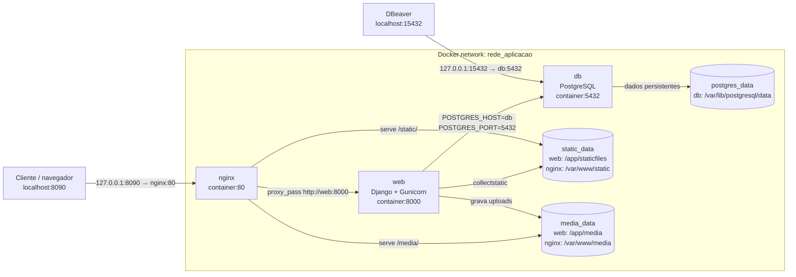
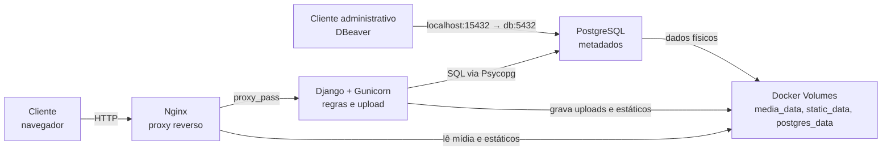
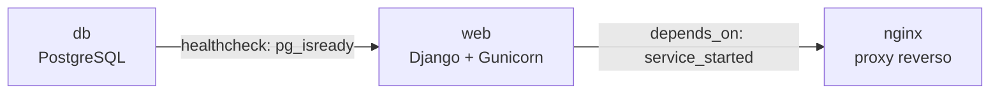
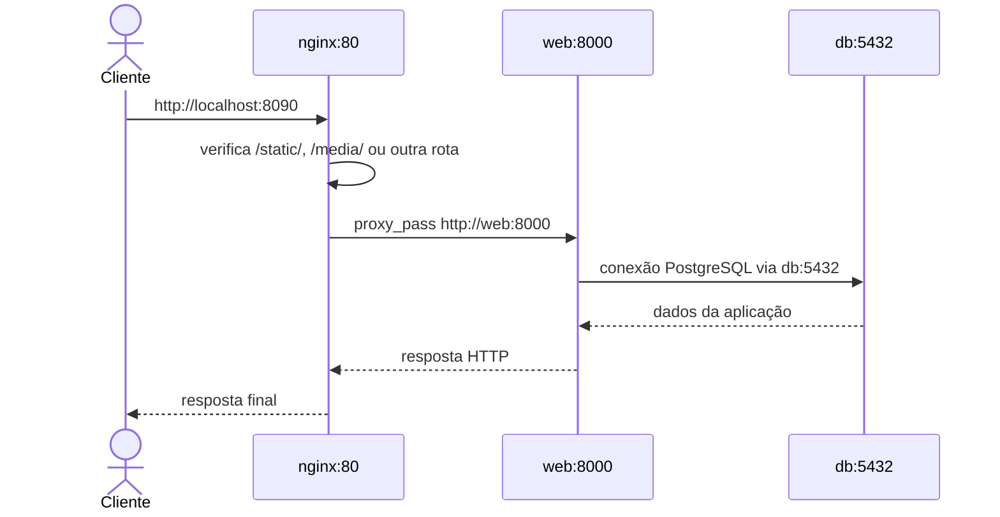
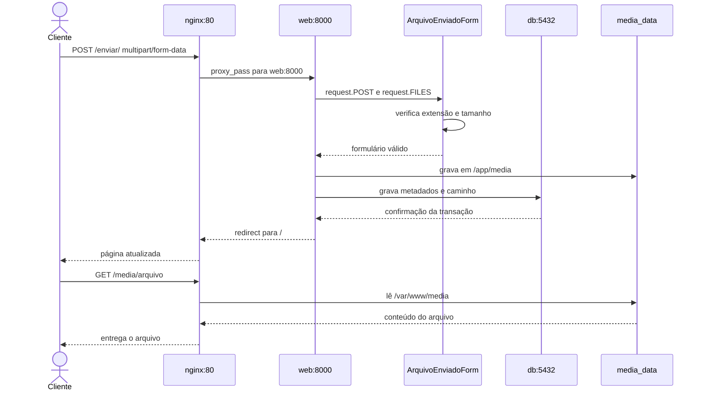

# Arquitetura da solução

Este arquivo é a fonte central de todos os diagramas da solução. O `README.md` apresenta os tópicos da defesa técnica e aponta para esta página, evitando manter cópias dos diagramas em locais diferentes.

## 1. Diagrama de Implantação (Deployment Diagram)

Representa onde os componentes são executados, as portas publicadas e internas, a rede Docker, os volumes e os clientes externos.

Portas externas: `localhost:8090` publica o Nginx e `localhost:15432` publica o PostgreSQL apenas para acesso local. Portas internas: `nginx:80`, `web:8000` e `db:5432`. O agrupamento representa a rede `rede_aplicacao`; os volumes ficam disponíveis enquanto os containers podem ser recriados.

## 2. Diagrama de Componentes

Representa a visão lógica da solução e a responsabilidade de cada componente, sem confundir componentes da aplicação com containers ou máquinas.

O Diagrama de Implantação responde **onde** cada elemento executa. O Diagrama de Componentes responde **como** as responsabilidades colaboram.

## 3. Dependências e inicialização dos serviços

Mostra a ordem lógica de disponibilidade definida no `docker-compose.yml`. O `web` depende do banco saudável; o Nginx depende do serviço web iniciado.

## 4. Diagrama de comunicação entre containers

Mostra as portas internas e os nomes resolvidos pelo DNS da rede Docker.

## 5. Diagrama de sequência do upload

Representa o caminho do arquivo desde o navegador até o volume persistente e o registro de metadados no PostgreSQL.

## Relação entre os diagramas e a implementação

| Elemento | Implementação |
|---|---|
| Cliente → Nginx | `PORTA_NGINX` (padrão `8090`) → porta `80` |
| Nginx → Django/Gunicorn | `proxy_pass http://web:8000` |
| Django → PostgreSQL | `POSTGRES_HOST=db` e `POSTGRES_PORT=5432` |
| Rede dos serviços | `rede_aplicacao` |
| Banco persistente | `postgres_data:/var/lib/postgresql/data` |
| Upload persistente | `media_data:/app/media` e `media_data:/var/www/media:ro` |
| Arquivos estáticos | `static_data:/app/staticfiles` e `static_data:/var/www/static:ro` |

Os nomes, portas, caminhos e volumes dos diagramas correspondem ao `docker-compose.yml` e ao `nginx/default.conf` atuais.

Consulte o [README principal](../README.md) para a explicação completa, execução, comandos e análise técnica.
