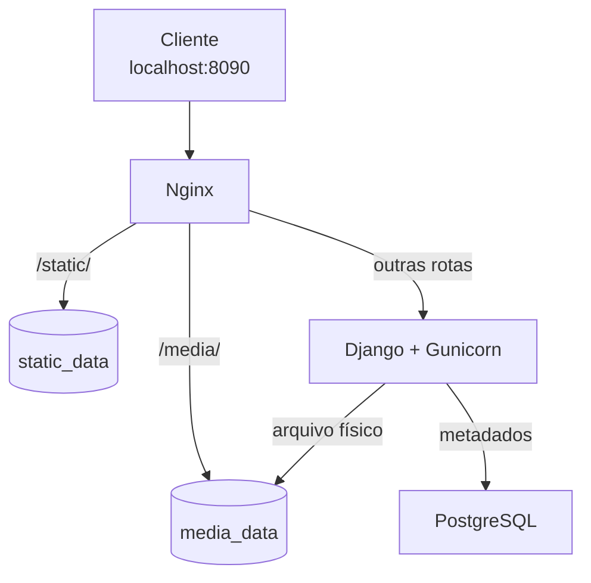

# Arquitetura

## Fluxo principal

## Responsabilidades

- `db`: executa o PostgreSQL e persiste dados no volume `postgres_data`.
- `web`: executa Django com Gunicorn, processa requisições e grava metadados no banco.
- `nginx`: recebe o tráfego HTTP, encaminha rotas dinâmicas para Django e serve arquivos estáticos e uploads.
- `docker-compose.yml`: conecta os serviços, declara volumes, variáveis, portas e dependências.
- `Dockerfile`: constrói a imagem própria da aplicação Django.
- `entrypoint.sh`: espera o banco, executa migrations, coleta estáticos e inicia o Gunicorn.

## Persistência do upload

O Django salva o arquivo em `/app/media`, montado no volume `media_data`. O Nginx monta o mesmo volume em `/var/www/media` como somente leitura e disponibiliza os arquivos pela URL `/media/`.

O banco guarda metadados como nome original, tamanho e data. O conteúdo binário fica no volume de mídia.

Consulte o [README principal](../README.md) para a árvore de arquivos, execução e comandos.
